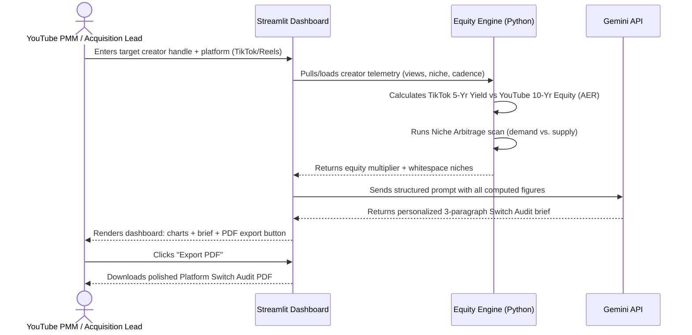
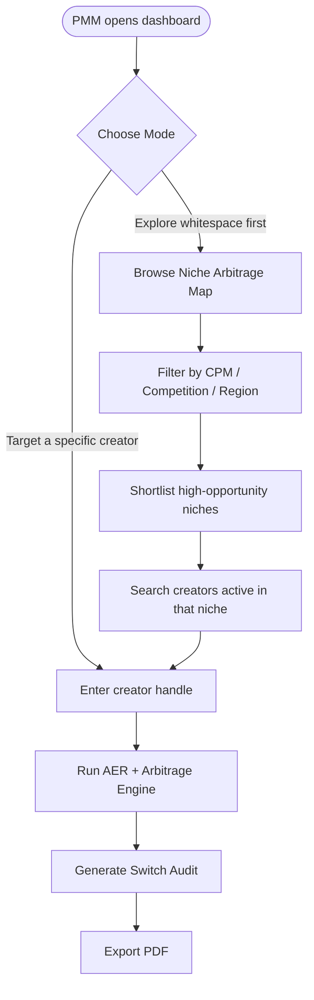

<div align="center">

# 🚀 YouTube Creator Equity Oracle
### *Competitor Arbitrage Engine & 10-Year Creator Asset Valuation System*

**Stop pitching creators on "come make videos here." Start proving, in dollars, what they lose every month by not doing it.**

[](https://python.org)
[](https://streamlit.io)
[](https://ai.google.dev)
[](https://plotly.com)
[](LICENSE)
[](#-roadmap--whats-next)

**Strategic PMM Pillar:** Platform Migration · Creator Acquisition · Long-Term LTV Asset Modeling
**Target APMM Competencies:** Competitive Intelligence · Strategic Positioning · Creator Economy Economics · Data-Driven Acquisition Playbooks

[Live Demo](#-quickstart) · [Architecture](#-system-architecture) · [User Flow](#-user-flow) · [Modules](#-core-product-modules) · [Repo Structure](#-repository-structure) · [Interview Pitch](#-the-60-second-interview-pitch)

</div>

---

## 📖 Table of Contents

1. [Executive Summary](#-executive-summary)
2. [The Problem Statement — The TikTok Treadmill](#-the-problem-statement--the-tiktok-treadmill)
3. [The Core Insight](#-the-core-insight)
4. [Key Features](#-key-features)
5. [System Architecture](#-system-architecture)
6. [User Flow](#-user-flow)
7. [Core Product Modules](#-core-product-modules)
8. [The Mathematics of Creator Equity](#-the-mathematics-of-creator-equity)
9. [Data Schema](#-data-schema)
10. [Gemini Prompt Engineering Pipeline](#-gemini-prompt-engineering-pipeline)
11. [Tech Stack](#-tech-stack)
12. [Repository Structure](#-repository-structure)
13. [Quickstart](#-quickstart)
14. [Sample Output Walkthrough](#-sample-output-walkthrough)
15. [Business Impact & KPIs](#-business-impact--kpis)
16. [What's New — Changelog](#-whats-new--changelog)
17. [Roadmap / What's Next](#-roadmap--whats-next)
18. [The 60-Second Interview Pitch](#-the-60-second-interview-pitch)
19. [FAQ](#-faq)
20. [About the Author](#-about-the-author)
21. [License](#-license)

---

## 📌 Executive Summary

**`youtube-creator-equity-oracle`** is a predictive financial intelligence engine built for YouTube Product Marketing Managers and Creator Acquisition leads.

It attacks YouTube's most persistent competitive leak in the creator economy: **creators spending the majority of their production time and creative energy on rival short-form platforms (TikTok, Instagram Reels), chasing 24–48 hour viral spikes, while treating YouTube as a secondary, cross-posted afterthought.**

TikTok's direct Creator Rewards RPM ($0.40–$1.00) *looks* more lucrative per short-form view than YouTube Shorts RPM ($0.02–$0.12) — but that comparison is the trap. TikTok content decays almost to zero economic value within 48 hours. YouTube content, by contrast, compounds for years through search indexing, subscriber funnels, memberships, and Shopping.

This engine doesn't argue that with adjectives. It argues it with a number: the **10-Year Asset Equity Rate (AER)**. It also scans the market for **High-Demand, Low-Supply Niche Arbitrage Whitespaces**, and auto-generates a personalized **"Platform Switch Audit"** — a data-backed migration pitch a PMM can actually send to a target creator.

> **In one sentence:** *It reframes "come post on YouTube" from a vague growth suggestion into a quantified financial argument a creator's accountant would respect.*

---

## 🔬 The Problem Statement — The TikTok Treadmill

### The Market Friction

Creators today are caught in a **Valuation Blindspot** — they are optimizing for the wrong number.

| # | The Trap | What's Actually Happening |
|---|----------|---------------------------|
| **1** | **The Ephemeral Decay Trap** | Rival-platform algorithms push content aggressively for 24–48 hours, then distribution collapses to near-zero. To sustain income, creators must produce 2–3 videos *per day*, driving severe, well-documented creator burnout. |
| **2** | **The Single-Stream Fallacy** | Short-form platforms are single-stream payout systems: you get paid once, for the view, and never again. Creators don't realize YouTube operates as a **Multi-Format Monetization Flywheel** — a single Short can seed long-form AdSense revenue, memberships, Super Thanks, Shopping tag revenue, *and* 5–10 years of evergreen search traffic, simultaneously. |

### The Platform Risk for YouTube

Every month a high-potential creator treats TikTok or Reels as "home base" and cross-posts a watermarked, algorithm-throttled clip to YouTube as an afterthought, **YouTube loses three things it can't easily buy back**:

- 🕐 **Primary creator production time** — the best ideas go to the platform they post to *first*.
- 💰 **Exclusive high-CPM viewer watch time** — long-form AdSense inventory nobody else is capturing.
- 🎯 **High-intent audience engagement** across Tier-1 advertiser markets.

```
┌──────────────────────────────────────────────────────────────────────────────┐
│                    THE CONTENT EQUITY & ARBITRAGE MATRIX                     │
├──────────────────────────────────────────────────────────────────────────────┤
│  RIVAL PLATFORMS (TikTok / Reels)      │  YOUTUBE ECOSYSTEM (Compounding)    │
│  • Content Lifespan: 24–48 Hours       │  • Content Lifespan: 5–10+ Years    │
│  • Single Stream: View Payouts Only    │  • Multi-Format Stack: Search + RPM │
│  • 10-Year Equity Value: ≈ $0          │    + Shopping + Memberships         │
│  ───────────────────────────────────────┼──────────────────────────────────────│
│  VERDICT: High Burnout, Zero Asset     │  VERDICT: High ROI, Compounding     │
│           Enterprise Value             │           Digital Real Estate       │
└─────────────────────────────────────────┴──────────────────────────────────────┘
```

---

## 💡 The Core Insight

> **YouTube content is not "a video." It is Yield-Generating Digital Real Estate.**

The engine's entire value proposition rests on shifting a creator's mental model from *"influencer producing disposable clips"* to *"founder building a compounding media enterprise."* Every module in this system exists to make that shift provable, personalized, and persuasive — not aspirational.

---

## 🔑 Key Features

- 📊 **10-Year Asset Equity Rate (AER) Calculator** — models compound decay-vs-discovery economics to project a creator's true long-term earnings on each platform.
- 🎯 **Predictive Niche Arbitrage Finder** — scans demand-vs-supply signals to surface high-CPM, low-competition content whitespaces.
- ✍️ **AI-Powered Platform Switch Audit Generator** — Gemini drafts a personalized, empathetic, commercially sharp migration brief for any target creator.
- 📈 **Interactive Executive Dashboard** — real-time Streamlit + Plotly visualization comparing short-form decay vs. long-form compounding equity.
- 📄 **One-Click PDF Export** — every audit brief and dashboard view exports as a clean, shareable PMM-ready document.
- 🧮 **Transparent, Auditable Math** — every dollar figure the engine outputs traces back to an inspectable formula, not a black box.

---

## 🏗️ System Architecture


**Data flow in plain English:** raw creator stats go in one end → get run through the equity math and the whitespace scanner → get handed to Gemini with a tightly engineered prompt → come out the other end as a polished, personalized outreach brief, rendered live in a dashboard and exportable as a PDF.

---

## 🧭 User Flow

There are two personas this tool serves. Both flows are mapped below.

### Flow A — The PMM / Creator Acquisition Lead (Primary User)



### Flow B — Exploratory Mode (Niche Research, No Target Creator Yet)



---

## 🛠️ Core Product Modules

The system runs three strategic modules in sequence, connected by a lightweight orchestration layer.

```
[ Rival Platform Telemetry ] ──► [ Module 1: AER Calculator ] ──► [ Module 2: Niche Arbitrage ]
 (Followers, Views, Niche)         (10-Year Equity Model)            (Supply vs Demand Gap)
                                                                              │
                                                                              ▼
   [ Gemini Prompt Pipeline ]  ──►   [ Module 3: Switch Audit ]  ──►  [ Streamlit Dashboard ]
                                       (Automated PMM Pitch)             (PMM Pitch & PDF Export)
```

### 🧮 Module 1 — The Asset Equity Rate (AER) Calculator

Takes a creator's average views, posting frequency, and niche parameters and projects the **10-Year Cumulative Asset Equity Value (E₁₀)** of publishing natively on YouTube vs. a rival platform.

**Modeled using a compound decay-and-search-discovery framework**, where:

| Variable | Meaning |
|---|---|
| `V_initial` | Initial viral short-form views |
| `λ` | Algorithmic decay rate — `λ_TikTok ≈ 0.95/week` vs. `λ_YouTube ≈ 0.15/week` (thanks to search indexing) |
| `V_search` | Evergreen search-discovery volume unique to Google/YouTube indexing |
| `g` | Organic subscriber compound growth rate feeding long-form views |
| `M_FanFunding` | Recurring revenue from Memberships, Super Thanks, and Shopping tags |

### 🔍 Module 2 — AI Predictive Niche Arbitrage Finder

Analyzes Google Search and YouTube query trends to surface **"Monetization Whitespaces."**

- **The Arbitrage Metric:** compares **Viewer Demand Velocity** (search-volume surge across Tier-2/Tier-3 cities and global markets) against **Creator Supply Density** (number of dedicated channels already producing quality content in that niche).
- **Target Output:** pinpoints specific niches — e.g. *Personal Finance for Regional Languages*, *AI Automation Walkthroughs*, *Gaming Hardware Reviews* — where creator competition on YouTube is low but advertiser CPMs are exceptionally high.

### ✍️ Module 3 — The "Platform Switch Audit" Generator (PMM Poaching Engine)

An automated outreach pipeline for YouTube Creator Acquisition Leads and Partner PMMs.

1. Ingests a target creator's handle from TikTok or Instagram.
2. Runs their profile through Modules 1 and 2.
3. Uses the Gemini API to construct a customized, data-backed **Platform Switch Pitch Brief** that quantifies the exact dollar amount of long-term enterprise value the creator is losing every month by posting on rival platforms first.

---

## 📐 The Mathematics of Creator Equity

### `src/equity_engine.py` — Core Logic

```python
import numpy as np
import pandas as pd

class CreatorEquityCalculator:
    def __init__(self, avg_monthly_views: float, niche_longform_rpm: float, niche_shorts_rpm: float = 0.04):
        self.views = avg_monthly_views
        self.long_rpm = niche_longform_rpm
        self.shorts_rpm = niche_shorts_rpm

    def calculate_tiktok_5yr_yield(self) -> float:
        """
        TikTok direct payout model: high immediate views, rapid algorithmic decay
        (decay_rate = 0.90), zero search-tail monetization.
        """
        annual_views = self.views * 12
        decay_rate = 0.90
        total_payout = 0
        current_views = annual_views

        # 5-Year horizon without compounding search assets
        for year in range(5):
            # TikTok Creator Rewards estimated ~$0.60 RPM on qualified views
            total_payout += (current_views / 1000) * 0.60
            current_views *= (1 - decay_rate)

        return round(total_payout, 2)

    def calculate_youtube_10yr_equity(self) -> float:
        """
        YouTube Multi-Format Ecosystem:
        Shorts feed attention funnels 8% of viewers into long-form content,
        plus evergreen Google/YouTube search tail compounding at 12% annually.
        """
        monthly_shorts_views = self.views
        funnel_to_longform_pct = 0.08   # 8% convert to watching long-form
        search_compound_growth = 0.12   # 12% annual search growth for evergreen topics

        total_equity = 0
        annual_longform_views = (monthly_shorts_views * funnel_to_longform_pct * 12)

        for year in range(1, 11):
            # 1. Shorts Direct Feed Revenue
            shorts_revenue = ((monthly_shorts_views * 12) / 1000) * self.shorts_rpm

            # 2. Long-Form AdSense Funnel Revenue (High RPM)
            longform_revenue = (annual_longform_views / 1000) * self.long_rpm

            # 3. Fan Funding Stack (Memberships + Super Thanks ~ 15% lift on AdSense)
            fan_funding = longform_revenue * 0.15

            # Year total
            year_total = shorts_revenue + longform_revenue + fan_funding
            total_equity += year_total

            # Compound long-form views via Search Indexing & Subscribers
            annual_longform_views *= (1 + search_compound_growth)

        return round(total_equity, 2)


if __name__ == "__main__":
    calc = CreatorEquityCalculator(avg_monthly_views=3_000_000, niche_longform_rpm=7.50)
    tt_yield = calc.calculate_tiktok_5yr_yield()
    yt_equity = calc.calculate_youtube_10yr_equity()

    print(f"TikTok 5-Year Total Earnings:            ${tt_yield:,.2f}")
    print(f"YouTube 10-Year Enterprise Equity Value:  ${yt_equity:,.2f}")
    print(f"Monetization Gap Multiplier:               {round(yt_equity / (tt_yield + 1e-5), 1)}x")
```

> ⚠️ **Transparency note (important for interviews):** every RPM, decay rate, and growth constant above is a **documented, clearly-labeled assumption** — not a scraped real-time figure. This is intentional: it keeps the model auditable and defensible. A production version would replace these constants with live YouTube Analytics API and licensed industry-benchmark data feeds.

---

## 🗃️ Data Schema

### `data/creator_telemetry.csv`

```csv
creator_handle,primary_platform,niche,avg_monthly_views,posting_frequency_weekly,est_tiktok_rpm,est_yt_longform_rpm,sub_conversion_rate
@tech_tok_daily,TikTok,Tech_Reviews,4500000,5,0.65,6.50,0.012
@finance_reels_in,Instagram,Personal_Finance,2800000,4,0.40,9.20,0.018
@gaming_shorts_master,TikTok,Gaming,8200000,7,0.30,3.80,0.008
```

| Column | Type | Description |
|---|---|---|
| `creator_handle` | string | Public handle on the rival platform |
| `primary_platform` | enum | `TikTok` \| `Instagram` |
| `niche` | string | Primary content category |
| `avg_monthly_views` | int | Trailing 30-day average views |
| `posting_frequency_weekly` | int | Uploads per week |
| `est_tiktok_rpm` | float | Estimated rival-platform RPM ($) |
| `est_yt_longform_rpm` | float | Estimated YouTube long-form RPM ($) for the niche |
| `sub_conversion_rate` | float | Estimated Shorts → long-form / subscriber conversion rate |

---

## 🤖 Gemini Prompt Engineering Pipeline

Configured in `src/ai_generator.py` — this exact prompt drives the automated Switch Audit briefs:

```text
SYSTEM PROMPT: You are a Senior Partner Product Marketing Manager (PMM) at YouTube
Creator Growth, Gurugram. Your objective is to convince high-value creators currently
posting on TikTok and Instagram Reels to migrate their primary production focus to
YouTube natively.

INPUT DATA:
- Creator Handle: {creator_handle}
- Current Primary Platform: {primary_platform}
- Niche: {niche}
- Monthly Views: {avg_monthly_views}
- Estimated TikTok 5-Year Earnings: ${tiktok_5yr_yield}
- Projected YouTube 10-Year Enterprise Equity: ${yt_10yr_equity}
- Calculated Equity Multiplier: {equity_multiplier}x

TASK:
Draft a personalized, highly persuasive, 3-paragraph "Platform Switch Audit" brief
for this creator.

REQUIREMENTS:
1. Tone: Empathetic, commercially sharp, executive-level, non-pushy ("Creator First").
2. Paragraph 1: Acknowledge their recent success on {primary_platform} in the
   {niche} category, validating their creative effort.
3. Paragraph 2: Introduce "Content Ephemerality vs. Compounding Equity." Use the
   calculated figures to show how posting natively on YouTube builds
   ${yt_10yr_equity} in compounding digital real estate across long-form, search
   discovery, and fan funding.
4. Paragraph 3: Offer a concrete, low-friction next step — a 30-day "YouTube-First
   Launch Playbook" with dedicated partner support.
```

**Why this prompt is engineered this way:** it forces the model to (1) validate the creator emotionally before pitching anything — critical for not sounding predatory, (2) ground every persuasive claim in a number the engine already computed rather than letting the model invent figures, and (3) end on a specific, low-friction call to action instead of a vague "consider switching."

---

## 🧰 Tech Stack

| Layer | Technology | Purpose |
|---|---|---|
| **Language** | Python 3.11+ | Core application logic |
| **UI Framework** | Streamlit | Interactive executive dashboard |
| **Data Processing** | Pandas, NumPy | Cohort processing & equity decay modeling |
| **Visualization** | Plotly Express | Real-time comparison charts |
| **AI Orchestration** | Google Gemini API (`google-genai`) | Switch Audit brief generation |
| **PDF Export** | ReportLab / WeasyPrint | Exportable PMM-ready pitch documents |
| **Data Storage** | CSV / SQLite (local-first) | Creator telemetry & niche benchmark data |

---

## 📁 Repository Structure

```
youtube-creator-equity-oracle/
│
├── 📂 data/
│   ├── creator_telemetry.csv          # Sample rival-platform creator dataset
│   ├── niche_benchmarks.csv           # RPM, competition & CPM data by niche
│   └── data_dictionary.md             # Field-level documentation
│
├── 📂 notebooks/
│   ├── 01_eda_creator_telemetry.ipynb # Exploratory data analysis
│   ├── 02_equity_model_validation.ipynb
│   └── 03_niche_arbitrage_scan.ipynb
│
├── 📂 src/
│   ├── __init__.py
│   ├── equity_engine.py               # Module 1 — AER Calculator
│   ├── arbitrage_finder.py            # Module 2 — Niche Arbitrage Finder
│   ├── ai_generator.py                # Module 3 — Gemini Switch Audit pipeline
│   ├── pdf_exporter.py                # PDF generation utilities
│   └── utils.py                       # Shared helpers
│
├── 📂 app/
│   ├── app.py                         # Main Streamlit entry point
│   ├── components/
│   │   ├── dashboard_charts.py
│   │   ├── creator_input_form.py
│   │   └── audit_brief_card.py
│   └── assets/
│       └── styles.css
│
├── 📂 docs/
│   ├── PRD.md                         # Product Requirements Document
│   ├── gtm_brief_template.md
│   └── screenshots/
│
├── 📂 tests/
│   ├── test_equity_engine.py
│   └── test_arbitrage_finder.py
│
├── requirements.txt
├── .env.example                       # Gemini API key placeholder
├── .gitignore
├── LICENSE
└── README.md                          # ← You are here
```

---

## 🚀 Quickstart

```bash
# 1. Clone the repository
git clone https://github.com/GaneshEiGo/youtube-creator-equity-oracle.git
cd youtube-creator-equity-oracle

# 2. Create a virtual environment (recommended)
python -m venv venv
source venv/bin/activate        # Windows: venv\Scripts\activate

# 3. Install dependencies
pip install -r requirements.txt

# 4. Configure your Gemini API key
cp .env.example .env
# then edit .env and add: GEMINI_API_KEY=your_key_here

# 5. Run the Streamlit dashboard
streamlit run app/app.py
```

The dashboard will open at `http://localhost:8501`.

---

## 🖥️ Sample Output Walkthrough

1. **Input:** `@gaming_shorts_master`, TikTok, Gaming niche, 8.2M avg monthly views
2. **Engine computes:**
   - TikTok 5-Year Yield: **~$XX,XXX**
   - YouTube 10-Year Equity: **~$XXX,XXX**
   - Equity Multiplier: **~X.Xx**
3. **Dashboard renders:** side-by-side decay-vs-compounding chart, niche arbitrage heatmap for "Gaming Hardware Reviews," and the auto-generated Switch Audit brief
4. **PMM clicks "Export PDF"** → downloads a polished, ready-to-send pitch document

*(Add real screenshots to `docs/screenshots/` and embed them here once the dashboard is built — this section is intentionally left as a template.)*

---

## 📊 Business Impact & KPIs

| Metric | Business Target | Strategic Importance |
|---|---|---|
| **Competitor Migration Rate (%)** | 15% conversion of targeted rival creators | Measures success in poaching top talent from TikTok/Reels |
| **Share of Creator Time (SCT)** | Shift from 20% → 70% of time spent producing for YouTube | Ensures creators go YouTube-first, not YouTube-also |
| **Ecosystem Revenue Multiplier** | 3.5x–8.0x higher LTV on YouTube | Proves the financial superiority of YouTube's multi-format flywheel |
| **Niche Arbitrage Capture Rate** | Fill 80% of identified whitespaces | Populates high-CPM search queries with fresh creator inventory |

---

## 🆕 What's New — Changelog

### `v1.0.0` — Initial Portfolio Release
- ✅ Core AER Calculator (Module 1) with 10-year compounding model
- ✅ Niche Arbitrage Finder (Module 2) with demand/supply scoring
- ✅ Gemini-powered Switch Audit Generator (Module 3)
- ✅ Streamlit dashboard with Plotly visualizations
- ✅ PDF export pipeline
- ✅ Sample dataset + documented data dictionary

*(Update this section as the project evolves — recruiters and hiring managers notice active changelogs.)*

---

## 🗺️ Roadmap / What's Next

- [ ] Replace static RPM/decay constants with live YouTube Analytics API integration
- [ ] Add a "Creator Self-Serve" mode — let creators run their own equity audit, not just PMMs
- [ ] Expand Niche Arbitrage Finder with Google Trends API for real-time demand signals
- [ ] Add multi-language Switch Audit generation (Hindi, Telugu, Tamil) for India-market outreach
- [ ] Build a batch-mode CLI for auditing 100+ creators at once
- [ ] Add historical accuracy backtesting — validate AER projections against real creator outcomes

---

## 💬 The 60-Second Interview Pitch

> *"TikTok and Instagram Reels trap creators on a short-form hamster wheel where videos suffer from rapid algorithmic decay after 48 hours. Creators see higher short-form RPMs on TikTok, but they miss the bigger commercial picture: YouTube isn't just a video feed, it's a compounding digital asset ecosystem.*
>
> *I built `youtube-creator-equity-oracle` to win the battle for creator production time. The engine uses mathematical modeling to calculate a creator's 10-Year Asset Equity Rate, demonstrating how a single YouTube Short funnels attention into high-RPM long-form search views, channel memberships, and YouTube Shopping tags.*
>
> *It also scans search trends to locate high-demand, low-supply 'Niche Arbitrage Whitespaces,' and integrates with Gemini to auto-generate data-backed 'Platform Switch Audits' that YouTube PMM teams can send directly to top TikTok creators. It shifts creator psychology from 'influencer making disposable clips' to 'founder building a compounding media enterprise on YouTube.'"*

---

## ❓ FAQ

<details>
<summary><strong>Is the "10-Year Equity Value" a real financial guarantee?</strong></summary>
<br>
No — and it's not meant to be. Every constant in the model (decay rates, RPMs, growth rates) is clearly documented as an estimate based on publicly known platform economics. The tool's purpose is to make the <em>relative</em> argument — long-form/search compounding vs. short-form decay — quantifiable and persuasive, not to promise exact future earnings.
</details>

<details>
<summary><strong>Where does the creator telemetry data come from?</strong></summary>
<br>
For this portfolio build, data is simulated/mocked to resemble realistic creator analytics exports. A production version would pull from the YouTube Data API, TikTok's public API where available, and licensed third-party creator-analytics providers.
</details>

<details>
<summary><strong>Why Gemini instead of a static template for the Switch Audit?</strong></summary>
<br>
A templated pitch reads like spam. Gemini lets the brief adapt its acknowledgment, tone, and framing to each creator's specific niche and numbers — making a mass-outreach tool feel like a one-on-one conversation.
</details>

<details>
<summary><strong>Can this be adapted for other creator-acquisition use cases?</strong></summary>
<br>
Yes — the same architecture (telemetry → equity model → arbitrage scan → AI-generated brief) generalizes to any platform-migration or creator-recruitment scenario, not just TikTok-to-YouTube.
</details>

---

## 👤 About the Author

**Kaduri Ganesh**
Graduate Engineer (B.Tech, Electrical & Electronics Engineering) · Product-Minded Builder · YouTube Creator & Audience Strategist

Built this project as part of a portfolio for the **Associate Product Marketing Manager — YouTube Marketing** role, combining hands-on creator-growth experience (500+ subscribers in 2 months, 100K+ views in a single month) with operational scaling experience (governing a $30M / ₹250Cr+ portfolio across 10,000+ nodes, scaling adoption from 5% to 60% in a 30-day sprint) and product-analysis experience (1,000+ user feedback logs analyzed at ICMG).

📧 **Email:** kaduriganesh7@gmail.com
🔗 **LinkedIn:** [linkedin.com/in/kaduri-ganesh-bbb327360](https://linkedin.com/in/kaduri-ganesh-bbb327360)
💻 **GitHub:** [github.com/GaneshEiGo](https://github.com/GaneshEiGo)

---

## 📄 License

This project is licensed under the **MIT License** — see the [LICENSE](LICENSE) file for details.

---

<div align="center">

### ⭐ If this project's framing was useful to you, consider starring the repo.

*Built to prove a point: the best product marketing isn't a slogan — it's a number nobody can argue with.*

</div>
